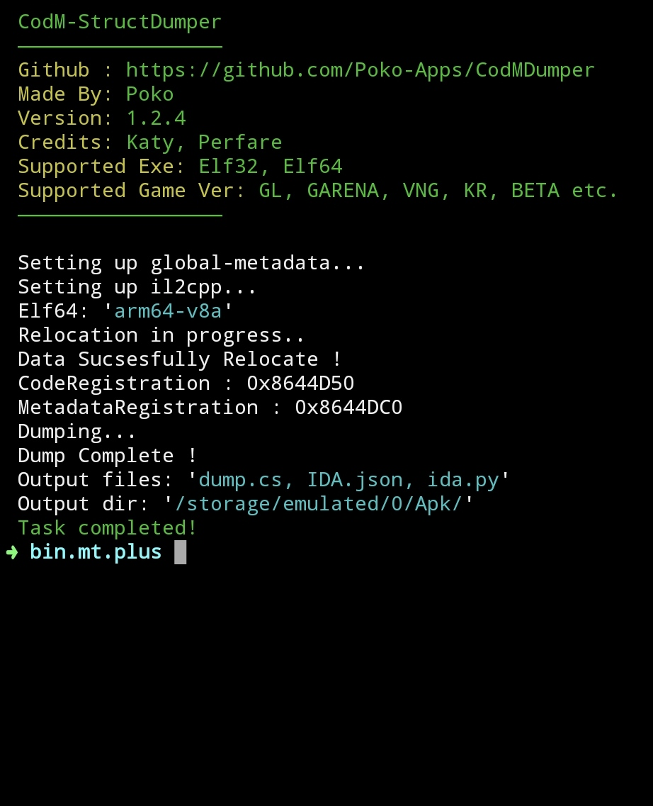
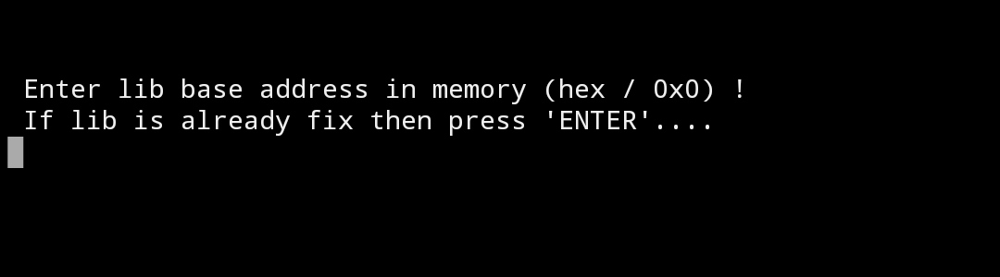

# About CodDumper

This is CodMDumper (Call Of Duty Mobile Dumper) that can dump libil2cpp.so of call of duty mobile.
Specifically made for codm .

## Supported Versions
1) Almost All CodM version Including Most popular Global, Garena, VNG, KR. 
2) 32bit (armeabi-v7a) & 64bit (arm64-v8a) supported.
3) x86 not supported

## Files To Download
You have to download the ***.zip*** file from release section. Zip have 2 files !! first one is the main binary executable and
second one is the extansion (yes , it's extansion) file for the Dumper .
 * CodDumper.so
 * extansion.p0k0
## Requirements
Nothing but a Android device with Termux or MT manager installed !
1. (Note : you can use any other terminal too as well as any other Linux based system too !)

## Made With | Environment
I've made this dumper originally in android (posix , unix based)
So don't expect to use this on Windows ! 
It may work on other Linux systems though .

# Features

- Inbuilt Elf Fixer ! 
> 
- generate **'dump.cs'** !
- for better analysis, generate
    * **'IDA.json' & 'ida.py'**
- can dump with original metadata & memory dumped lib

# Important
1) you have to use memory dumepd il2cpp.so (GG might work)
2) yes !! Original ***global-metadata.dat*** will work properly (if not then dump it from the memory)

# How to use
After downloading the release ***'.zip'*** and extracting it , you can execute the **CodDumper.so** in any
Terminal of android (or Linux based systems) ! I'll guide you how to use them in most popular terminal
of android called ***Termux*** . and I'll guide you how to Run it in one of most popular file manager called ***MT manager*** 's terminal too !

Just remember these 3 steps before going below 👇
1) make sure **CodDumper.so** and **extansion.p0k0** present in the same directory !
2) give execute permission (777) to the **CodDumper.so** !
3) finally, run it !

* **Termux**
  * Open termux , give storage permission if you haven't 
  > Command : termux-setup-storage
  * Make sure extracted file's are in Termux ***$HOME*** directory !
  * Go to where the **CodDumper.so** is (must be in termux's data directory or $HOME directory)
  * Give executable permission !
  > Command : chmod +x CodDumper.so
  * Run the Dumper , and you'll know how to use it !
  > Command : ./CodDumper.so

* **MT Manager**
  * Open MT manager , then find the package name of the Mt manager !(eg: **'bin.mt.plus'**)
  > Note : look 'Android/data/' directory for the pkg name!
  * move both **CodDumper.so** and **extansion.p0k0** to data directory of MT manager! 
  * > Path : **'/data/user/0/pkg.name/'**
  * > Eg . : **'/data/user/0/bin.mt.plus/'**
  * Then, give 777 permission to the ***CodDumper.so***
  > Long press to the executable file -> property -> permission (modify) -> check all (except last bottom row)
  * Then open the terminal !
  > Click on Top-Left (3 line) -> Terminal Simulator
  * Change the working directory to MT manager's data directory
  > Command : cd /data/user/0/pkg.name/
  * * Run the Dumper , and you'll know how to use it !
  > Command : ./CodDumper.so

# Download 
* [Release V1.2.4](https://github.com/Poko-Apps/CodMDumper/releases/download/v1.2.4/)
* [Direct Link](https://github.com/Poko-Apps/CodMDumper/releases/download/v1.2.4/CodDumper.zip)

# Communication
 * [Discord](https://discord.gg/XxBYZztJdE)
 * bisbaas89@gmail.com
